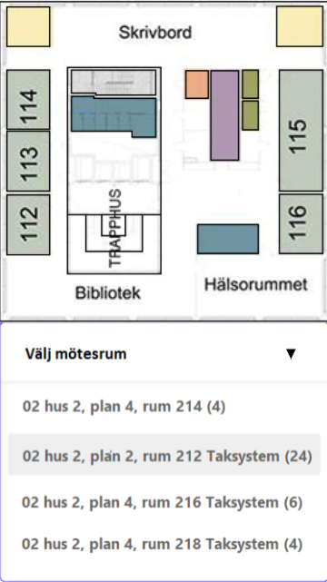
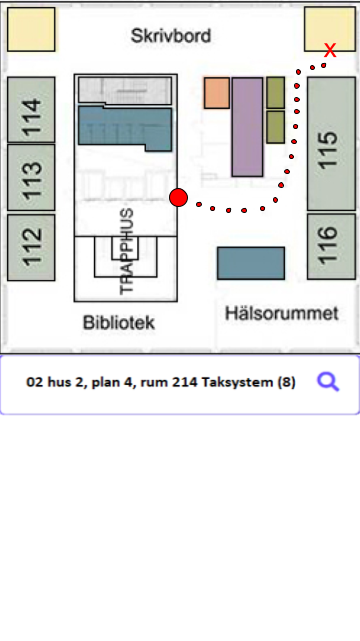
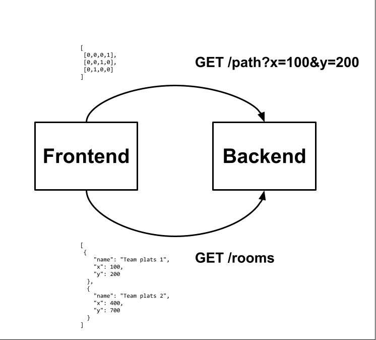

<h1>Joint Project</h1>
<h2>Inledning</h2>

På AF uppmuntras medarbetarna att delta i kompetens utvecklande aktiviteter regelbundet. Joint Project är ett initiativ för att uppnå detta mål, på ett praktiskt, produktivt, inkluderande och bidragande sätt.

Joint Project siktar på att producera en produkt som kan användas av medarbetarna dagligen, och åstadkomma möjligheten att utveckla nya kompetens hos involverade utvecklarna.

Vår forskning har visat oss att det uppstår ett krav för en applikation som hjälper medarbetarna på HK för att navigera sin väg runt. Joint Project kommer producera denna applikation för medarbetarna. 

<h2>Produktbeskrivning och featurelistan</h2>

Vi har planerat att produkten skall innehålla följande ’Features’: 

<ul>
    <li>Pathfinding</li>
    <li>Användarvänligtgränssnitt  (Karta)</li>
        <ul>
      <li>Högupplösta bilder</li>
      <li>Börja med plan 4 (positionering,karta..osv)</li>
    </ul>
    <li>Startpunkt: hissen</li>
    <li>Ange destination </li>
    <li>Geolocation (v2)</li>
    <li>Rumhistorik/favoriter (v2)</li>
</ul>

<h2>UI-prototyp</h2>

<h2>Dataflödesdiagram</h2>

<h2>Hur vi kan marknadsföra vår produkt</h2>

Har ni svårt att hitta på HK? Vi kanske har lösningen

Grupp på intranätet - Dialog om HK Elektrogatan

Där kan man initiera t.ex. frågan ovan

Man kan även marknadsföra till nyheter i nyhetsbrevet som skickas ut till allas mail

Barbro kan ta på sig att gå in för att stå för inlägget som skrivs

Bra att ha med användartester

Vi kan behöva sätta ett datum för att informera dom om produkten i så fall och där vi kan hänvisa till vårat design dokument

Barbro kan hjälpa oss med vad vi behöver skriva i så fall när vi ska marknadsföra

Vi måste ta reda på hur många som får vara i lokalen samtidigt innan vi bokar ett informationsmöte

<h2>Roller för respektive teammedlem</h2>
<ul>
  <li>Christian Hall: Backend</li>
  <li>Andrew Bwogi: Frontend</li>
  <li>Khosro Jadidi: Test</li>
  <li>Khaled Al Asad: Frontend</li>
  <li>Christian Fujimaki Ahlsen : Backend</li>
</ul>
